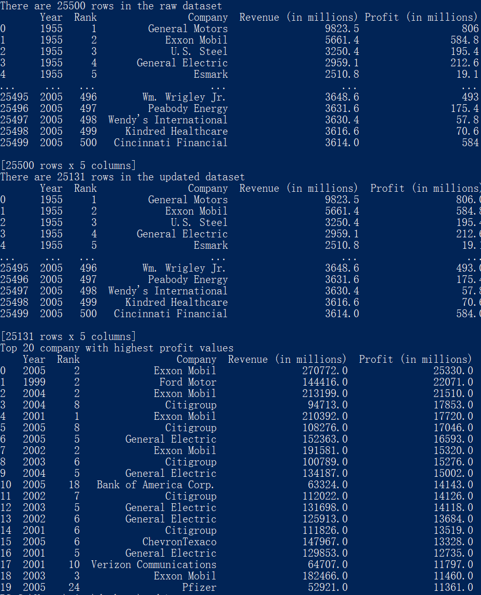
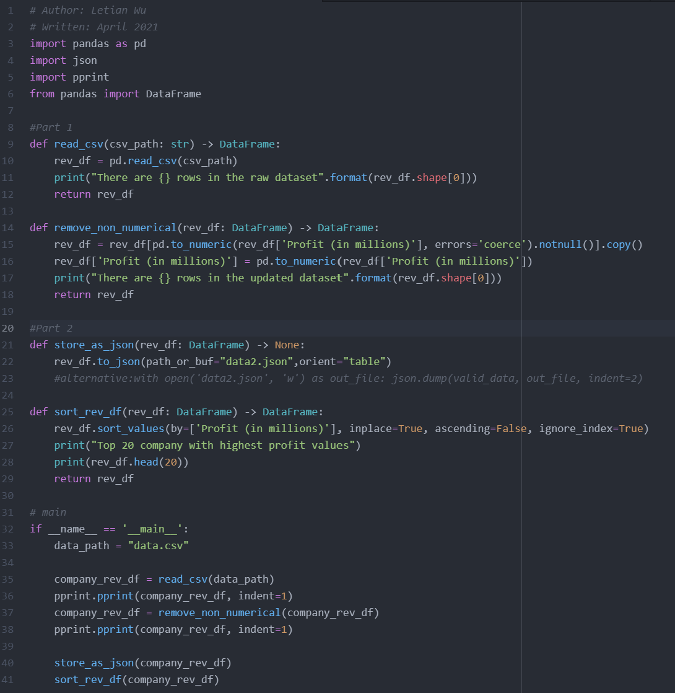

# SADA_gcp_challenges_highest-profit
Read a CSV file containing corporate profits over the years and create JSON format data and look for highest profit values in the data.

# Output

# Main Code

# Part3 thoughts about SQL
SELECT TOP 20 FROM DataSet
ORDER BY Profit DESC
